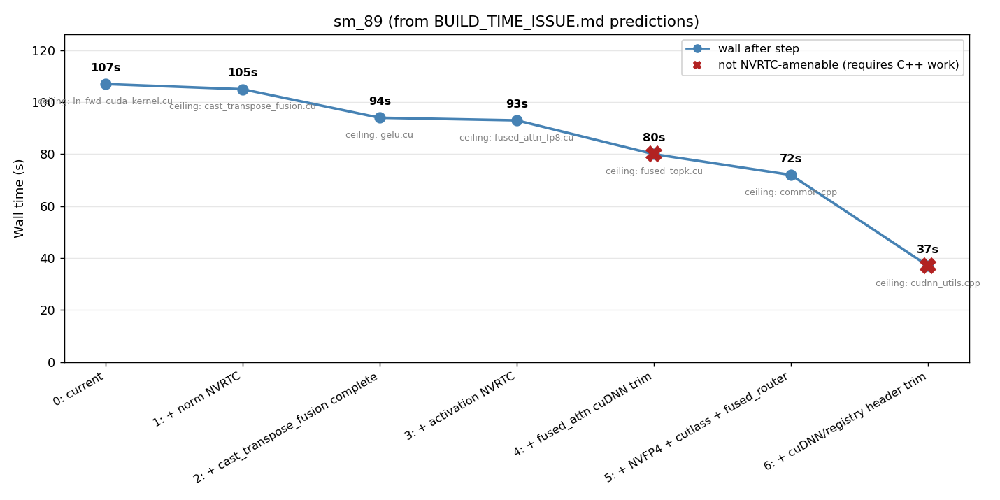
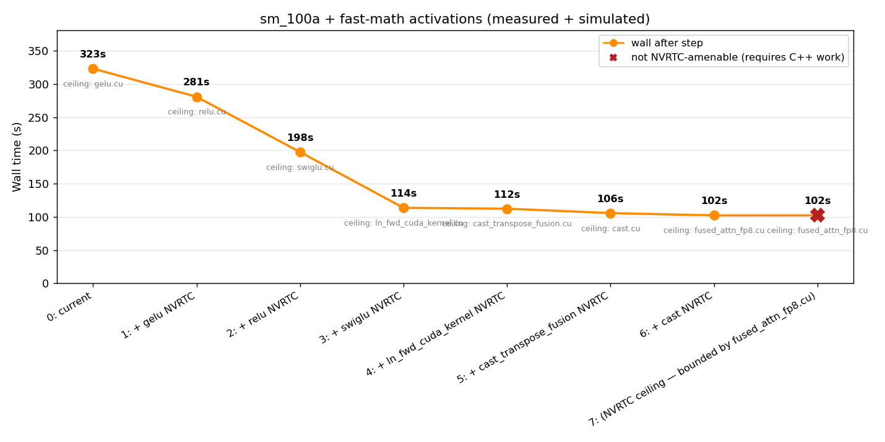

# Reduce TE build time by migrating template-heavy kernels to NVRTC

## Problem

Build time for Transformer Engine is currently very long.

## Hypothesis

This is dominated by compilation of heavily templated CUDA kernels. Each `.cu` translation unit expands template products over (dtype × layout × hidden-size × ...) axes at build time, producing large object files (multi-MB each) and long per-TU `nvcc` invocations. Many of these template axes are runtime-discoverable, so the work could be deferred to NVRTC and amortized across only the kernel variants actually invoked.

The pattern is already in use under [`transformer_engine/common/transpose/rtc/`](../tree/main/transformer_engine/common/transpose/rtc) (cast-transpose, transpose, swap-first-dims, cast-transpose-fusion).

This issue tries to model the impact of the this migration.

## Build time analysis

### Measurement methodology

All measurements are on a single workstation: 32 logical CPUs, 125 GB RAM, NVIDIA driver + `nvcc 13.1` (CUDA 13.1), host compiler `g++ 12` (forced via `-DCMAKE_CUDA_HOST_COMPILER=/usr/bin/g++-12` to dodge a gcc-13 ICE). Build target is `libtransformer_engine.so` (the C++ common library, framework wrappers excluded).

Two configurations were measured:

- **sm_89** (initial measurement): `-DCMAKE_CUDA_ARCHITECTURES=89`, no extra flags.
- **sm_100a + fast-math activations** (closer to production build): `-DCMAKE_CUDA_ARCHITECTURES=100a -DNVTE_BUILD_ACTIVATION_WITH_FAST_MATH=ON` — matches `NVTE_CUDA_ARCHS="100a" NVTE_BUILD_ACTIVATION_WITH_FAST_MATH=1`, which is what the user actually builds with.

Clean full build of the common library:

```bash
# After cmake configure of build/cmake/ (the location pip uses)
/usr/bin/time -f "wall=%es cpu_user=%Us cpu_sys=%Ss max_rss=%MKB" \
  .venv/bin/ninja -C build/cmake transformer_engine
```

Per-TU breakdown comes from parsing the ninja log with a script made by claude.

### sm_89 — current state

```
wall    = 110.89 s
cpu_user = 1624.70 s          # sequential-equivalent compile work
cpu_sys  =   71.75 s
max_rss  = 4063 MB            # peak across all parallel nvcc jobs
outputs  = 79 TUs + 1 link
sequential compile total = 1797.1 s
effective parallelism = 1797.1 / 110.89 = 16.2× (50.6% of 32 cores)
```

Parallelism drops sharply during the build because only a handful of long-pole TUs survive past ~70 s:

| t (s) | concurrent nvcc jobs |
| --: | --: |
| 10 | 34 |
| 30 | 22 |
| 50 | 15 |
| 70 | 11 |
| 90 |  5 |
| 100 | 2 |
| 110 | 1 |

Top 10 long-pole TUs:

| TU | End at (s) | Elapsed (s) |
| --- | --: | --: |
| `transpose/cast_transpose_fusion.cu` | 104.9 | 104.9 |
| `normalization/layernorm/ln_fwd_cuda_kernel.cu` | 107.3 | 100.4 |
| `activation/gelu.cu` | 94.1 | 94.1 |
| `fused_attn/fused_attn_fp8.cu` | 93.4 | 87.5 |
| `fused_attn/fused_attn_f16_arbitrary_seqlen.cu` | 88.5 | 82.7 |
| `activation/relu.cu` | 85.2 | 85.2 |
| `normalization/layernorm/ln_bwd_semi_cuda_kernel.cu` | 84.8 | 78.0 |
| `fused_router/fused_topk_with_score_function.cu` | 80.3 | 61.4 |
| `normalization/rmsnorm/rmsnorm_bwd_semi_cuda_kernel.cu` | 77.0 | 69.9 |
| `gemm/cutlass_grouped_gemm.cu` | 76.8 | 76.7 |

#### sm_89 — predicted wall as TUs migrate to NVRTC

Greedy migration order (longest NVRTC-amenable TU first), with non-amenable bounds marked with a red X. Data from the report's "Predicted wall-clock by phase" table:



The NVRTC-only track (steps 1–3, plus the NVFP4/cutlass piece of step 5) bottoms out around **93 s wall** before hitting the cuDNN-frontend bound at `fused_attn_fp8.cu`. The big remaining win (37 s wall) requires non-NVRTC C++ work on cuDNN-frontend host headers.

### sm_100a + fast-math activations

```
wall    = 323.67 s
cpu_user = 2503.29 s
cpu_sys  =   92.26 s
max_rss  = 4524 MB
outputs  = 79 TUs + 1 link
sequential compile total = 2848.5 s
effective parallelism = 2848.5 / 323.67 = 8.8× (27.5% of 32 cores)
```

Same code, same machine, same compilers — only the target arch and the fast-math activation flag differ. Wall time **+192%**, sequential compile work **+58%**, effective parallelism **−46%** (because three TUs now run alone for most of the build).

Concurrency profile (notice the long tail past 120 s where only the three activation TUs are still building):

| t (s) | concurrent nvcc jobs |
| --: | --: |
| 10 | 34 |
| 30 | 34 |
| 60 | 19 |
| 90 | 11 |
| 120 | 4 |
| 150 | 3 |
| 180 | 3 |
| 210 | 2 |
| 240 | 2 |
| 270 | 2 |
| 300 | 1 |
| 320 | 1 |

Top 10 long-pole TUs (with sm_89 elapsed and growth factor for comparison):

| TU | End (s) | Elapsed (s) | sm_89 elapsed (s) | ratio |
| --- | --: | --: | --: | --: |
| `activation/gelu.cu`                                  | **323.3** | **323.3** | 94.1  | **3.4×** |
| `activation/relu.cu`                                  | 280.9     | 280.9     | 85.2  | 3.3× |
| `activation/swiglu.cu`                                | 197.7     | 197.7     | n/a   | — |
| `normalization/layernorm/ln_fwd_cuda_kernel.cu`       | 122.5     | 113.6     | 100.4 | 1.1× |
| `transpose/cast_transpose_fusion.cu`                  | 112.3     | 112.3     | 104.9 | 1.1× |
| `cast/cast.cu`                                        | 105.7     | 105.7     | n/a   | — |
| `fused_attn/fused_attn_fp8.cu`                        | 109.7     | 102.2     | 87.5  | 1.2× |
| `normalization/layernorm/ln_bwd_semi_cuda_kernel.cu`  | 105.7     | 97.3      | 78.0  | 1.2× |
| `fused_attn/fused_attn_f16_arbitrary_seqlen.cu`       | 101.1     | 93.7      | 82.7  | 1.1× |
| `normalization/rmsnorm/rmsnorm_fwd_cuda_kernel.cu`    | 96.6      | 87.0      | 66.9  | 1.3× |

The activation TUs grew **3.3–3.4×** going from sm_89 to sm_100a + fast-math; everything else grew only **1.1–1.3×**. Almost certainly the FP8/MXFP8/NVFP4 fanout in `activation_template.h` × SM 100a's richer ISA, amplified by `--use_fast_math` enabling more optimization passes. `cast/cast.cu` also jumped into the top tier (wasn't in the sm_89 top 10).

#### sm_100a — predicted wall as TUs migrate to NVRTC

Same greedy migration model (longest NVRTC-amenable TU first, post-NVRTC floor of 5 s per the report's "Realistic floor" column), simulated against the measured top-25 from the ninja log:



Three observations:

- Migrating just `gelu.cu` drops wall by **~42 s** (323 → 281).
- Migrating gelu + relu + swiglu drops wall by **~210 s** (323 → 114). That's where the curve elbows.
- Beyond the elbow the curve flattens to ~102 s — bounded by `fused_attn_fp8.cu`, which is **not NVRTC-amenable** (cuDNN-frontend host metaprogramming). Migrating any further amenable TU below that gives **zero** wall improvement.

The plot also makes the difference vs sm_89 visually obvious: the sm_89 curve is a near-straight descent from 107 s to ~37 s, while the sm_100a curve has a sharp cliff at the activation TUs followed by a flat plateau at the cuDNN-frontend bound.

### Critical-path mechanics

Wall-clock build time is set by the **longest single TU**, not by total CPU work. Even when an NVRTC migration drops a TU's compile from N seconds to zero, the build's wall-clock only shrinks until the **next-longest TU** becomes the new ceiling.

The two builds give very different pictures of where that ceiling sits:

- On **sm_89** the top of the curve is a flat plateau: cast_transpose_fusion at 105 s, ln_fwd at 100 s, gelu at 94 s, fused_attn_fp8 at 88 s, … Any single NVRTC migration only buys a few seconds of wall before the next TU becomes the ceiling. `fused_attn/fused_attn_fp?.cu` is set by cuDNN-frontend host metaprogramming, not kernel templates, so NVRTC cannot help — and it caps total achievable improvement at ~10% e2e for the NVRTC-only track on sm_89.
- On **sm_100a + fast-math** the curve has a tall, narrow spike at activations (gelu 323 s, relu 281 s, swiglu 198 s) followed by a much lower plateau at ~95–115 s (norms, cast_transpose_fusion, cast, fused_attn). A single NVRTC migration that pulls activations down to runtime would drop wall from **324 s to ~113 s** — about **−65% e2e** from one phase. The cuDNN-frontend ceiling that bounded sm_89 only kicks in *after* activations are dealt with.

## Conclusion

The recommended priority order depends entirely on which arch you build for.

**For sm_100a + fast-math (what we actually ship):**

1. **Activation NVRTC is the single biggest unblocker by a wide margin.** gelu/relu/swiglu account for the entire long tail of the build (t ≈ 120 s onward). Migrating `activation_template.h` to NVRTC should drop wall from 324 s to ~113 s on this machine. Nothing else in the NVRTC track comes close.
2. After activations, the next ceiling is `ln_fwd_cuda_kernel.cu` at ~113 s, immediately followed by `cast_transpose_fusion.cu`, `cast.cu`, and the fused_attn pair — a dense ~95–115 s plateau. Normalization NVRTC, completing the cast-transpose-fusion migration, and a `cast.cu` NVRTC migration become useful here, but only after activations.
3. `fused_attn/fused_attn_*.cu` is bounded by cuDNN-frontend host-side template work and is **not** NVRTC-amenable. Past ~95 s of wall, only conventional C++ work (Pimpl around `cudnn_frontend.h`, TU splits, header trims) can move the floor.

**For sm_89:** the original conclusion still holds and is kept as an appendix below.

The practical implication is that the previously-planned sequencing (softmax → normalization → cast_transpose_fusion → activation) has activations dead last, which is exactly backwards for the build configuration we actually use. The plan should reorder activation NVRTC to first, with softmax retained only as a reference implementation pattern.

## Appendix: sm_89-only earlier conclusion

The original analysis was done on sm_89 only, where the conclusion was much less dramatic:

`fused_attn/fused_attn_fp?.cu` come from cudnn-frontend, so nvrtc migration is not helpful. This sets the max improvement we could get from this at ± 10% e2e, on my machine.

A first try at if-gating the normalization kernels (no nvrtc, just not building the normalization kernels) saves about 6s e2e.

Not sure how we could push through the fused_attn kernel for further improvements yet.

This conclusion is correct *for sm_89* but does not generalize: on sm_100a, activation NVRTC alone moves wall by ~65%, far beyond the ±10% ceiling implied by the cuDNN-frontend bound on sm_89.
